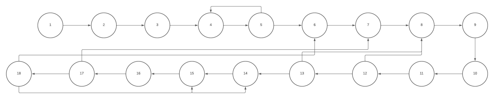

# Teste de Caixa Branca - Etapa 2

## Descrição
Desta vez usando o mesmo codigo escolhido para realizamos o teste de Caixa Branca, estaremos apresentando um Grafo de Fluxo, sua Complexidade Ciclomatica e a base de Caminhos correspondente ao codigo.

## Utilidade
Testes de caixa branca são cruciais para entender o funcionamento interno do código. Grafos de fluxo ajudam a visualizar o controle do programa. Complexidade ciclomática mede a complexidade do código. A base de caminhos avalia quantos caminhos diferentes foram executados em testes.

## Representacao do Grafo de Fluxo

## Calculo de Complexidade Ciclomatica
Formula: M = E - N + 2P

M = 24 - 18 + 2*3

M = 12

Complexidade Ciclomatica = M

## Base de Caminhos utilizada
1;2;3;4;5;4;6;7;8;9;10;11;12;8;13;8;14;15;14;16;17;18;15;18;6
