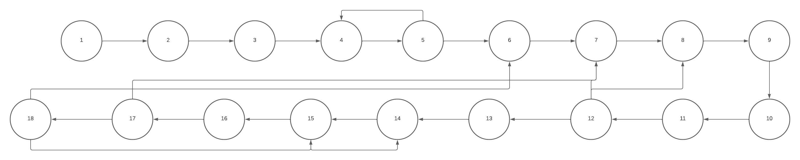

# Teste de Caixa Branca - Etapa 2

## Descrição
Desta vez usando o mesmo codigo escolhido para realizamos o teste de Caixa Branca, estaremos apresentando um Grafo de Fluxo, sua Complexidade Ciclomatica e a base de Caminhos correspondente ao codigo.

## Utilidade
Testes de caixa branca são cruciais para entender o funcionamento interno do código. Grafos de fluxo ajudam a visualizar o controle do programa. Complexidade ciclomática mede a complexidade do código. A base de caminhos avalia quantos caminhos diferentes foram executados em testes.

## Representacao do Grafo de Fluxo

## Erros localizados durante análise
- O nome da classe do driver MySQL está errado.
- A exceção Exception é genérica demais.
- Falta de boas práticas na estrutura do código como um todo.
- O método conectarBD() é desnecessário.
- As variáveis nome e result não têm valor inicial.
- O método verificarUsuario() não fecha a conexão com o banco de dados.
- Má administração da formatação.
- Utilização errada do método Catch.

## Observações e Requisitos
Não foi possível rodar o código por conta da quantidade de erros excessiva em sua construção. Foi utilizada a IDE Eclipse e versão 19 do JDK.
